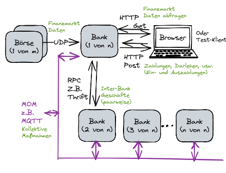
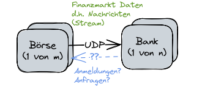
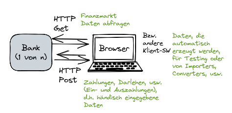
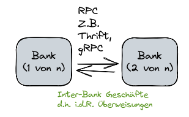
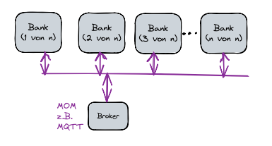

# VS-Praktikum
Repo for VS
## Hinweise zu Docker

- **Starten der Docker-Compose.yml-Datei**
    <pre>
    docker-compose up --build
    </pre>

## Aufgabenstellung
- **Das Gesamtsystem**

    

- **Aufgabe 1 - UDP Sockets**
    
    [https://www.geeksforgeeks.org/udp-server-client-implementation-c/](https://www.geeksforgeeks.org/udp-server-client-implementation-c/)
    
    Im ersten Schritt sollen zwei Komponenten realisiert werden: Börsen und Banken.
    
     
    
    Jede Bank hält eine simulierte Menge Wertpapiere, deren Wert sich ständig ändert. 
    
    Die Börse liefern einen Strom von Nachrichten, und zwar per UDP.
    
    
    
    Eine Nachricht besteht aus folgenden Komponenten: der Kürzel des Wertpapiers, 
    das soeben gehandelt wurde, die Stückzahl und der Preis. 
    
    Also könnte als Beispiel
    50 Aktien vom Lillisoft (Kurzel: LSFT) für 280€ ver- bzw. gekauft sein. Wenn
    die Erste Allgemeine Bank von Lilliput im Besitz von 1000 LSFT Aktien ist,
    sind sie nun 280.000€ wert. Wenn vorher der Preis von LSFT 300€ war, hat
    das Portfolio der Erste Allgemeine Bank einen Verlust von 20.000€.
    
    Der neue Gesamtwert des Portfolios soll nach Empfang jeden Nachrichten neu
    berechnet werden und im Text zum ”Standard Out“ ausgegeben werden.
    
    Hinweis: 
    
    Sie sollen für Ihre Simulation eine Menge von Wertpapieren samt Kürzel
    und Anfangspreisen selbst definieren. 
    
    Die Nachrichten sollen auch simulierte, d.h. frei erfundene Ereignisse beschreiben. Überlegen Sie, wie man das mit Zufallszahlen machen kann, sodass die Schwankungen der Kurse weder ganz wild und chaotisch sind, noch allzu langweilig bleiben. In der Finanzanalyse würde man sagen, Sie sollen fur eine ausgemessene simulierte Volatilität sorgen.
    
    Überlegen Sie, wie Sie Ihr System testen wollen. Sie sollen einerseits sicherstellen, 
    dass das System korrekt ist. Darüber hinaus sollen Sie die Leistung (Performanz)
    Ihres Systems messen. Dafür müssen Sie entscheiden, was genau zu messen ist. Zum 
    Beispiel kann Round Trip Time (RTT) nicht gemessen werden, solange Daten
    nur von den Börsen an den Banken übertragen werden. Also muss etwas anders 
    gemessen werden — oder Daten auch in die andere Richtung fließen.
    Werten Sie die Performanz Ihres Systems statistisch valide aus und erstellen Sie
    ein (sehr kurzes) Messprotokoll das den Test und die Ergebnisse darstellt.
    
    *Wenn Sie den Bonus erwerben wollen, überlegen Sie auch, ob die 
    hier beschriebene Kommunikation wirklich ausreicht. Wie sollen die Börsen wissen, an wen Sie Nachrichten schicken sollen? Weiter, während manche Wertpapiere mehrmals per Sekunde gehandelt werden, werden andere ein oder zweimal per Jahr gehandelt. Wie soll eine Bank wissen, wie viel ein solches Wertpapierwert ist?*
    
- **Aufgabe 2 - Sockets und HTTP**
    
    Im nächsten Schritt sollen den Mitarbeiter:innen der Banken eine Web-Schnittstelle zur Verfügung gestellt werden. D.h. die Banken-Komponenten aus Aufgabe 1 sollen erweitert werden.- Die UDP-Schnittstelle bleibt erhalten und muss am Laufen bleiben.
    
    Die neue Webschnittstelle hat zwei Hauptfunktionen:
    
    1. Es soll möglich sein, der Gesamtwert der Bank zu erfahren. Das soll per HTTP GET erfolgen.
    
    2. Weiter soll es möglich sein, neue Daten händisch einzugeben. Dass soll per HTTP POST erfolgen.
    
    Diese Schnittstellen sind in Abbildung 3 dargestellt.
    
    
    
    Die neuen Daten, die eingegeben werden können, sollen Sie selbst definieren.
    
    Gedacht sind hier Ein- und Auszahlungen, wenn Kunden Geld abholen oder anlegen, Kredite bekommen oder zurückzahlen, usw. usf. Die Mitarbeiter:innen dürfen auch Änderungen im Portfolio einer Bank machen, d.h. Wertpapier kaufen oder verkaufen.
    
    Die Banken haben hiermit nun auch Geldreserven und ausstehende Krediten. Das geht auch in dem Gesamtwert der Banken ein. Das heißt, dass die Daten, die per HTTP POST eingegeben werden, Einflüsse auf der Gesamtwert der Bank haben. 
    
    Diese Ereignisse haben also Konsequenzen für die HTTP GET Schnittstelle und für die UDP Schnittstelle.
    
    Die HTTP-Schnittstelle soll in einem normalen Browser, z.B. Firefox oder Google Chrome, vorgeführt werden.  
    
    Sie müssen nur einen Browser unterstützen. D.h. entweder Firefox oder Google Chrome oder Internet Explorer, usw. usf. Sie müssen nicht unbedingt HTML verwenden, obwohl das für HTTP PUT zu empfehlen ist.
    
    Für die Performanz-Messungen können Sie auch einen eigenen Klient schreiben. Das wäre für die Bank sehr nützlich, falls sie später z.B. Daten automatisch importieren wollen. Es ist jedoch nicht streng notwendig, wenn Sie mit einem Browser die Performanz messen können.
    
    Definieren Sie hier neue Tests, die die Korrektheit der neuen HTTP-Schnittstelle feststellen. 
    
    Definieren Sie auch, wie die Performanz der Schnittstelle gemessen werden kann. Wiederholen Sie auch die Performance-Tests aus Aufgabe 1 und vergleichen Sie die Testergebnisse, um festzustellen, ob die Performance der UDP-Schnittstelle gelitten hat.
    
    Dokumentieren Sie die alle Erkenntnisse in einem Messprotokoll und geben Sie es im Moodle ab.
    
    HTTP soll nur mit Hilfe von Sockets und ohne weitere Hilfsmittel (d.h. ohne externe HTTP-Bibliotheken) implementiert werden. Es ist hierbei erforderlich, dass eingehende HTTP Anfragen komplett und korrekt eingelesen und verarbeitet werden. Das bedeutet u.a., dass GET und POST unterschieden werden müssen und, dass es nicht ausreichend ist, nur die erste Zeile eine HTTP Nachricht zu lesen.
    
    *Für den Bonus ist bunte HTML nicht unbedingt interessant; HTML und CSS werden in anderen Lehrveranstaltungen behandelt. Viel interessanter wäre eine ausgereifte Kommunikation, die die Arbeit der Mitarbeiter:innen erleichtert. Einer ausbaufähige eigene Importer- bzw. Converter-Klient wäre hier auch sinnvoll.*
    
- **Aufgabe 3 - Remote Procedure Calls (RPC)**
    
    Bis jetzt wurden die Kommunikation zwischen Börsen und Banken in Aufgabe 1 simuliert, und in Aufgabe 2 die Kommunikation zwischen einer Bank und ihrer Mitarbeiter:innen simuliert. 
    
    
    
    Nun sollen die Banken miteinander kommunizieren können, wie in Abbildung 4 zu sehen ist. Die Banken sollen mittels Remote Procedure Calls (RCP) einander Dienste anbieten und diese Dienste in Anspruch nehmen. Dafür ist Apache Thrift zu empfehlen, aber auch Google’s gRPC darf verwendet werden. Andere RPC-FGrameworks müssen beim Dozenten angefragt werden. 
    
    Die Dienste sollen Sie definieren. 
    
    Es soll möglich sein, dass eine Bank Geld von einer anderer Bank ausleiht. 
    
    Darüber hinaus sollen Überweisungen unterstützt werden. Keine Bank muss jedoch eine Überweisung ausführen; alle Transaktionen können verweigert werden. 
    
    Für Aufgabe 4 wird es wichtig sein, dass Überweisungen auch abgebrochen bzw. storniert werden können. 
    
    Ihre Simulation soll nun die Rettung einer Bank durch eine andere Bank simulieren können. D.h. einerseits, dass Sie in der Lage sein sollen, zu simulieren, was passiert, wenn eine Bank nicht mehr genug Geldreserve hat, im Fall eines Ansturms auf die Bank. 
    
    Weiter, in so einem Fall will eine Bank Geld von einer anderen Bank leihen. 
    
    Sie sollen so ein Szenario simulieren; sowohl wo die Bank gerettet wird, als auch wo sie in Konkurs geht. Die RPC Schnittstelle wird in der jeweiligen Interface Description Language (IDL) festgehalten. Wenn Sie z.B. Thrift verwenden, fangen Sie diese Aufgabe
    an, in dem Sie eine Thrift-Datei schreiben. 
    
    Die IDL wird auch dafür verwendet, Datenformate für die Datenübertragung zu definieren. Sie sollen nicht selbst die Daten enkodieren bzw. dekodieren. Es ist wichtig, dass die RPC Schnittstelle sinnvolle Funktionen enthält. Es ist zum Beispiel nicht erlaubt, dass in der IDL-Datei eine Funktion steht, mit einem Text-String als Eingabe und/oder einem Text-String als Ausgabe, wenn die Strings als JSON gedacht sind. Sie dürfen und sollen Text-Parameter nur für einfache Namen verwenden, nicht für Zahlen oder Datenstrukturen. Wenn Sie unsicher sind, fragen Sie Ihren Dozenten. Definieren Sie hier neue Tests, die die Korrektheit der neuen RPC-Schnittstelle
    feststellen. 
    
    Definieren Sie auch, wie die Performanz der Schnittstelle gemessen
    werden kann. 
    
    Wiederholen Sie die Performance-Tests aus Aufgabe 1 und 2 und
    vergleichen Sie die Testergebnisse, um festzustellen, ob die Performance der alten
    Schnittstellen gelitten hat.
    Dokumentieren Sie die alle Erkenntnisse in einem Messprotokoll und geben Sie
    es im Moodle ab.
    
    *Für den Bonus gibt es hier verschiedene Möglichkeiten. Zum Beispiel, eine wirklich gute, wohl überlegte RPC-Schnittstelle wäre geeignet. Auch gut wäre eine beeindruckende Simulation samt Aufzeichnungen, die eine Analyse ermöglichen. Besprechen Sie Ihre Pläne in jedem Fall mit Ihrem Dozent ab.*
    
- **Aufgabe 4 - Message-Oriented-Middleware (MOM)**

    Endlich sind wir soweit, dass wir die Rettung einer gefährdeten Bank durch einer Gruppe von Banken simulieren können.
    Hier sollen Sie Message-Oriented-Middleware (MOM) wie z.B. MQTT einsetzen.

    

    Hier ist jede Bank sowohl ein Publisher als auch ein Subscriber von Nachrichten.
    Zuerst sollen die Banken regelmäßig Ihre Gesamtwerte veröffentlichen. Die andere Banken sollen diese Informationen verwenden, um Entscheidungen zu      treffen.
    
    Besonders wichtig hier ist die Entscheidung, ob eine Bank eine andere Bank retten soll, wie in Aufgabe 3 schon simuliert wurde. Es soll also    vorkommen, dass eine Bank nur durch mehrere andere Banken gerettet werden kann, weil keine andere Bank bereit ist, sie alleine zu retten.
Die Rettung erfolgt per angepasste Two Phase Commit (2PC). Das heißt, eine Menge Banken werden gefragt, ob sie bereit sind, eine Menge Geld an die gefährdeten Bank zu überweisen. Erst wenn ausreichend viele Banken zustimmen, werden die Überweisungen bestätigt. Vgl. die Beschreibung von 2PC in der Vorlesung. Hinweis: Der 2PC Algorithmus setzt voraus, dass eine Komponente den 2PCProzess (d.h. die Wahl) koordiniert. Sie sollen selbst definieren, wie entschieden wird, welche Bank der Koordinator ist. 

    Wie bei jeder anderen Aufgabe, definieren Sie hier neue Tests, die die Korrektheit
der neuen MOM-Schnittstelle feststellen. 

    Definieren Sie auch, wie die Performanz der Schnittstelle gemessen werden kann. Wiederholen Sie die Performance-Tests aus Aufgabe 1, 2 und 3 und vergleichen Sie die Testergebnisse, um festzustellen, wie die Performance aller Schnittstellen leidet, wenn gleichzeitig die MOM-Schnittstelle unter Last steht. 

    Dokumentieren Sie die dabei alle gewonnene Erkenntnisse in Ihrem Messprotokoll und geben Sie es im Moodle ab.

    *Für den Bonus könnte ein Konsens-Algorithmus hierfür verwendet werden, z.B. der Raft Algorithmus oder ein Paxos Algorithmus.*
